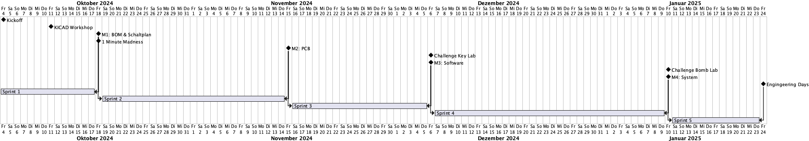

# Klopf-Klopf

# Inhalt
- [Sprint 1](./sprint_01.md)
- [Sprint 2](./sprint_02.md)
- [Sprint 3](./sprint_03.md)
- [Sprint 4](./sprint_04.md)
- [Sprint 5](./sprint_05.md)
- [Backlog](./backlog.md)
- [Product Summary](./produkt.md)
- [Schaltplan](./schaltplan.md)
- [Timeline](#timeline)

## Timeline

