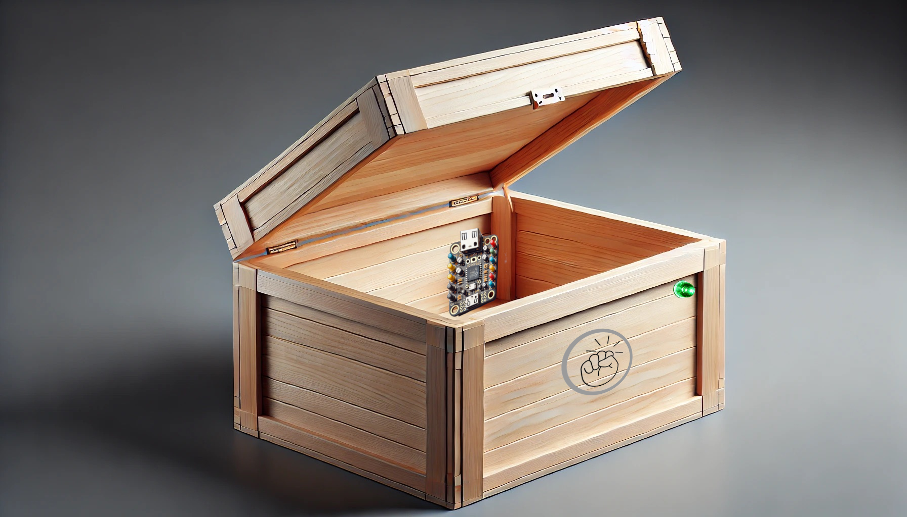
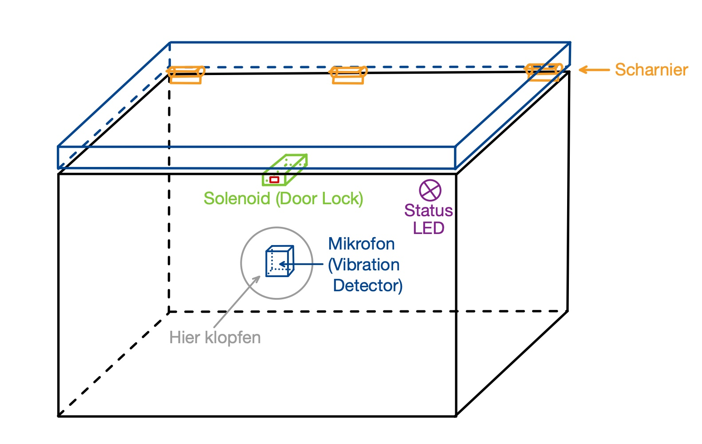
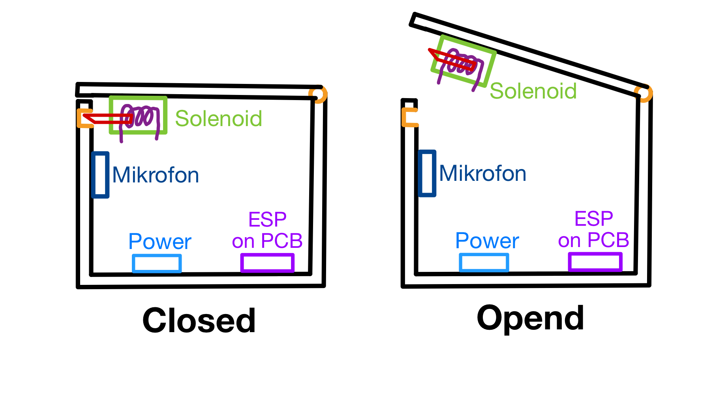

# Produkt

## Titel des Projekts: Klopf-Klopf (Topic 6 - Team B: Klopfmuster-Erkennung)

## Teammitglieder
- Jovan Arnaut: 1544440 
- Tom Arlt: 1335730
- Simon Vehreschild: 1543175

## Motivation
Ziel dieses Projektes ist es, den Umgang mit dem ESP32 und anderen elektrischen Komponenten zu erlernen und die grundlegende Funktionsweise des Mikrocontrollers zu verstehen. Außerdem wollen wir im Laufe des Projektes die Programmiersprache Assembler nachvollziehen und anwenden können.

## Beschreibung
Mit diesem Produktprototypen soll es möglich sein Klopfmuster zu erkennen und darauf zu reagieren. Es sollen Klopfmuster eingespeichert werden können, welche dann vom ESP32 wiedererkannt werden. Bei Erkennung eines eingespeicherten Klopfmusters soll das Schloss entriegelt werden. Da es für die Präsentation schwierig werden würde eine Tür zu verwenden, werden wir die Kopfmustererkennung nutzen, um eine Truhe zu entriegeln.

## Evaluation
Unser Produkt, die Klopfmustererkennung, ist in einer Truhe verbaut, die entriegelt wird, wenn das richtige Klopfmuster erkannt wird. Die Truhe ist mit einem Solenoid Schloss versehen, das durch den ESP32 gesteuert wird.
Die Funktionen, die bei unserem Produkt ausprobierbar sind, beinhalten das Einspeichern von neuen Klopfmustern, das Löschen von gespeicherten Klopfmustern, das Erkennen von Klopfmustern und das daraus folgende Öffnen des Schlosses. Das Schloss soll durch jeden geöffnet werden können, der eine der eingespeicherten Klopfmuster kennt. 

